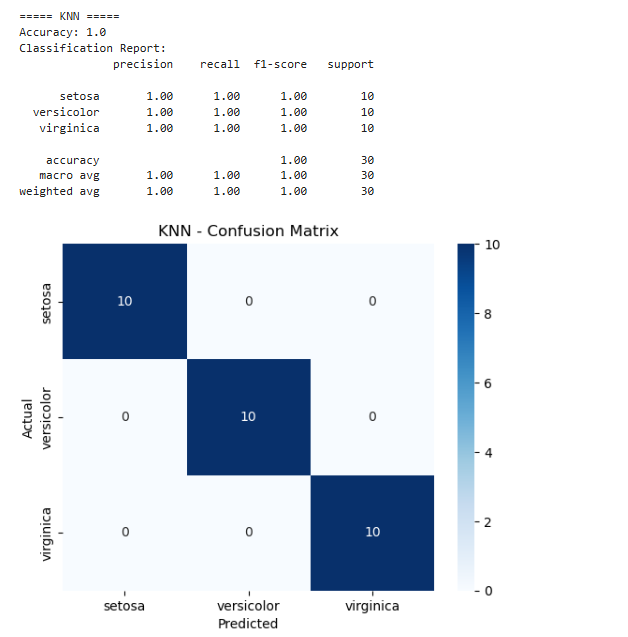

# Iris Flower Classification

## About
This project predicts the species of an iris flower (Setosa, Versicolor or Virginica) using its measurements: sepal length, sepal width, petal length and petal width.

## Dataset
The Iris dataset from scikit-learn (`load_iris()`). It has 150 rows, 4 features and 3 species (50 each). No missing values.

## Tools Used
Python, pandas, matplotlib, seaborn, scikit-learn, Jupyter Notebook

## What I Did
1. Loaded the dataset
2. Explored the data (shape, data types, null values, statistics)
3. Made graphs: pairplot and box plots
4. Found the most useful features
5. Split the data into 80% training and 20% testing
6. Trained 3 models: Logistic Regression, KNN, Decision Tree
7. Checked each model using accuracy, confusion matrix and classification report
8. Picked the best model

---

## Visualisations

### 1. Pairplot
Each small graph compares two features. Colours show the species.


**Observation:** Setosa (blue) is clearly separate from the other two. Versicolor and Virginica overlap a little.

### 2. Box Plots
Box plots for each feature, split by species.


**Observation:** Petal length and petal width show almost no overlap between species, so they are the best features. Sepal width overlaps a lot, so it is the least useful.

### 3. Confusion Matrices
Rows = actual species, columns = predicted species. Numbers on the diagonal are correct predictions.

**Logistic Regression**


**KNN**



**Decision Tree**


---

## Key Findings
- Petal length and petal width separate the species best.
- Sepal width overlaps a lot, so it is less useful.
- Setosa is easy to identify. Versicolor and Virginica are sometimes confused.

## Results
| Model | Accuracy |
|---|---|
| Logistic Regression | 96.67% |
| KNN | 100% |
| Decision Tree | 93.33% |

**Best model:** KNN, because it has the highest accuracy and made no wrong predictions on the test set.
(Note: the test set has only 30 flowers, so the models are very close to each other.)

## How to Run
```
pip install pandas matplotlib seaborn scikit-learn notebook
jupyter notebook
```
Open `01_Task.ipynb` and click **Kernel → Restart & Run All**.

## Files
- `01_Task.ipynb` : the full project code
- `images/` : all graphs used in this README
- `README.md` : this file
