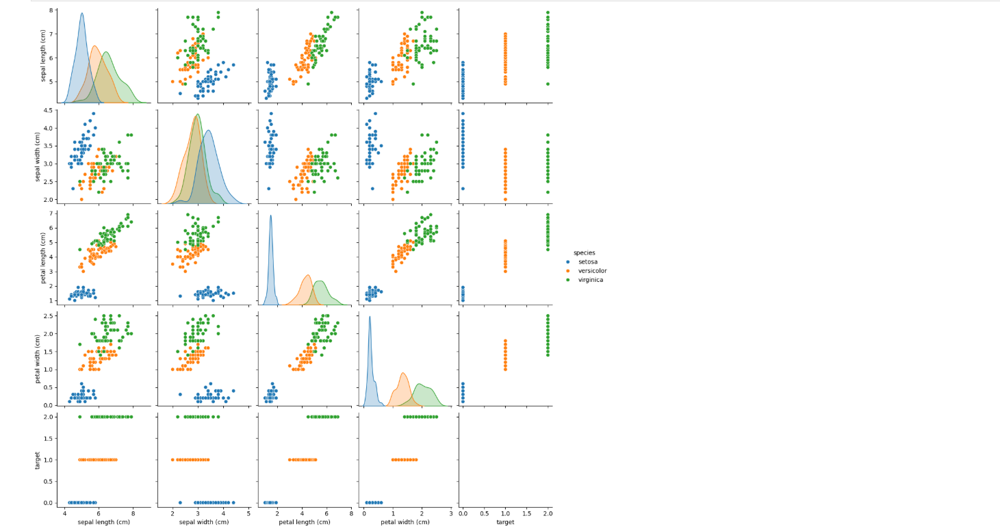
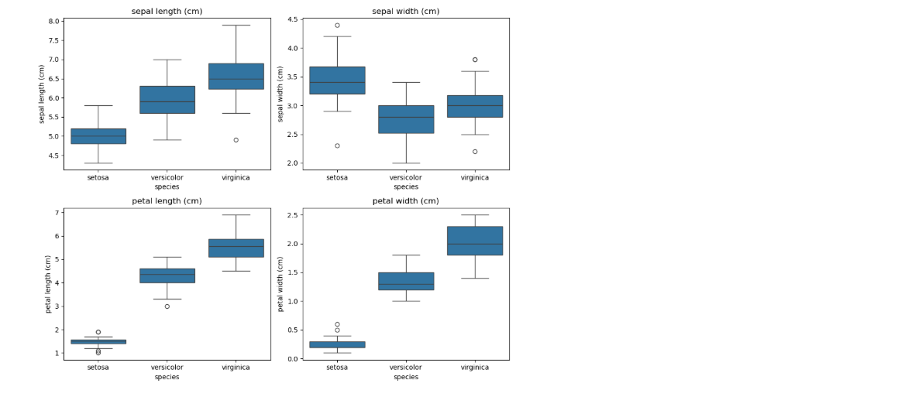
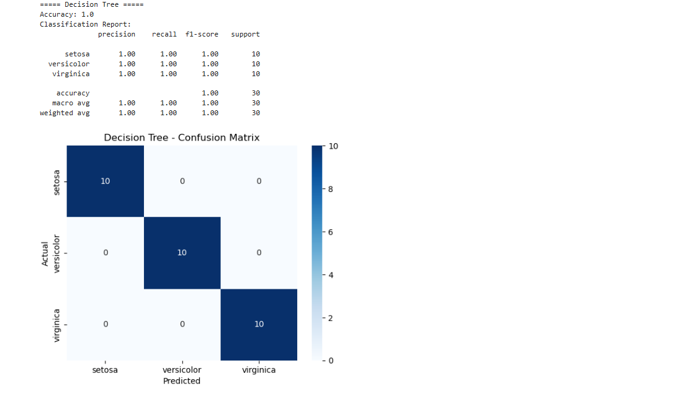

# Iris Flower Classification

## About
This project predicts the species of an iris flower (Setosa, Versicolor or Virginica) from its measurements.

## Tools Used
Python, pandas, matplotlib, seaborn, scikit-learn, Jupyter Notebook

## Dataset
Iris dataset from scikit-learn (`load_iris()`): 150 rows, 4 features, 3 species (50 each), no missing values.

## Steps
1. Loaded the data
2. Did EDA (shape, data types, null values, statistics)
3. Made graphs (pairplot and box plots)
4. Picked the best features
5. Split data: 80% train, 20% test
6. Trained 3 models: Logistic Regression, KNN, Decision Tree
7. Checked accuracy, confusion matrix and classification report
8. Chose the best model

## Graphs

### Pairplot


Setosa is clearly separate. Versicolor and Virginica overlap a little.

### Box Plots


Petal length and petal width separate the species best. Sepal width overlaps the most.

### Confusion Matrices

**Logistic Regression**


**KNN**


**Decision Tree**



## Findings
- Petal length and petal width are the most useful features.
- Sepal width is the least useful.
- Setosa is easy to identify. Versicolor and Virginica are sometimes confused.

## Results
| Model | Accuracy |
|---|---|
| Logistic Regression | 96.67% |
| KNN | 100% |
| Decision Tree | 93.33% |

**Best model:** KNN, because it has the highest accuracy and no wrong predictions on the test set. The test set has only 30 flowers, so the models are close.

## How to Run
1. Install the libraries:
```
pip install pandas matplotlib seaborn scikit-learn notebook
```
2. Start Jupyter:
```
jupyter notebook
```
3. Open `01_Task.ipynb` and click **Kernel → Restart & Run All**.
