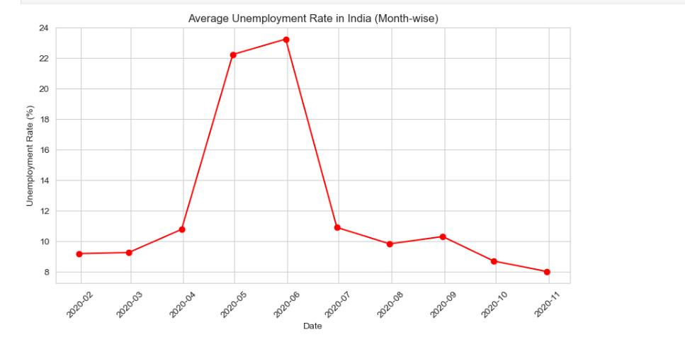
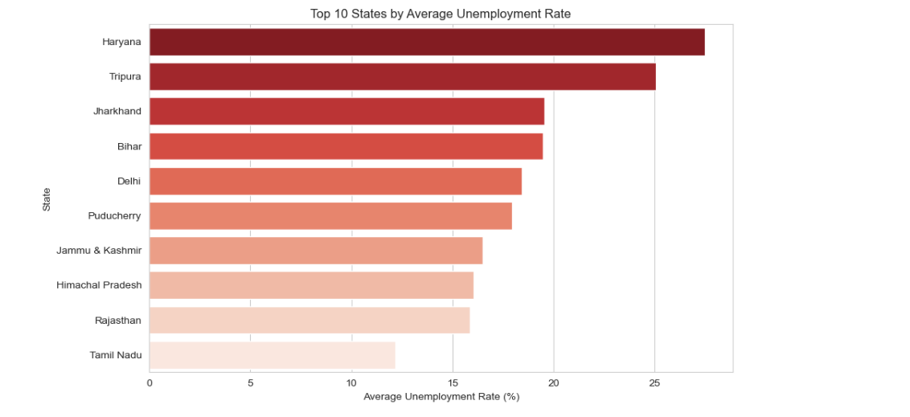
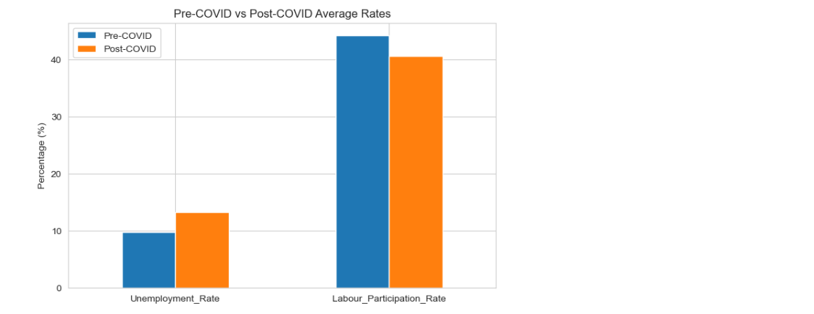
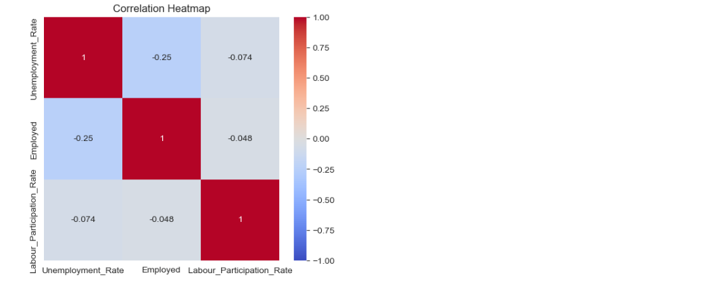

# Unemployment in India: COVID-19 Impact

A simple data analysis project that shows how unemployment in India changed across states and over time, especially during COVID-19.

## Dataset

- Unemployment in India (Kaggle)
- File: `Unemployment_Rate_upto_11_2020.csv`
- Period: May 2019 to October 2020

## Tools Used

- Python
- pandas
- matplotlib
- seaborn
- Jupyter Notebook

## What I Did

1. Loaded and cleaned the data
2. Found average unemployment by state and zone
3. Plotted the month-wise trend
4. Compared a few major states over time
5. Made a bar chart of the top 10 states
6. Made a heatmap of correlations
7. Compared pre-COVID and post-COVID (cut-off: 1 April 2020)

## Key Findings

- Unemployment peaked in **May 2020** at **23.24%**
- By **October 2020** it fell to **8.03%**, below the pre-COVID average
  
- Top 3 states by average unemployment: **Haryana (27.48%)**, **Tripura (25.05%)**, **Jharkhand (19.54%)**
- Lowest 3 states: **Meghalaya (3.87%)**, **Assam (4.86%)**, **Gujarat (6.38%)**
- Highest zone: **North (15.89%)**, lowest zone: **West (8.24%)**
  
  

## Pre-COVID vs Post-COVID

| | Pre-COVID | Post-COVID |
|---|---|---|
| Unemployment rate | 9.76% | 13.28% |
| Labour participation rate | 44.18% | 40.63% |

- Post-COVID unemployment is **1.36 times** higher
- Fewer people were working or looking for work after the lockdown
- Biggest increase: **Puducherry (+23.95)**, **Jharkhand (+13.30)**, **Tamil Nadu (+12.62)**
- Some states went down: **Sikkim (-15.75)**, **Tripura (-7.55)**, **Jammu & Kashmir (-3.96)**

## Observations

- The lockdown caused a sharp but short spike in unemployment
- The correlations are weak (unemployment vs employed: -0.25)
- `Employed` is a headcount, not a rate, so it depends on state size

## How to Run

1. Download the dataset from Kaggle and keep it in the same folder as the notebook
2. Install libraries: `pip install pandas matplotlib seaborn notebook`
3. Start Jupyter: `jupyter notebook`
4. Open the notebook and run all cells from top to bottom

## Limitations

- Only monthly data for a short period
- Averages are not adjusted for state population
- Post-COVID average includes both the peak and the recovery

## Author

Your Name
