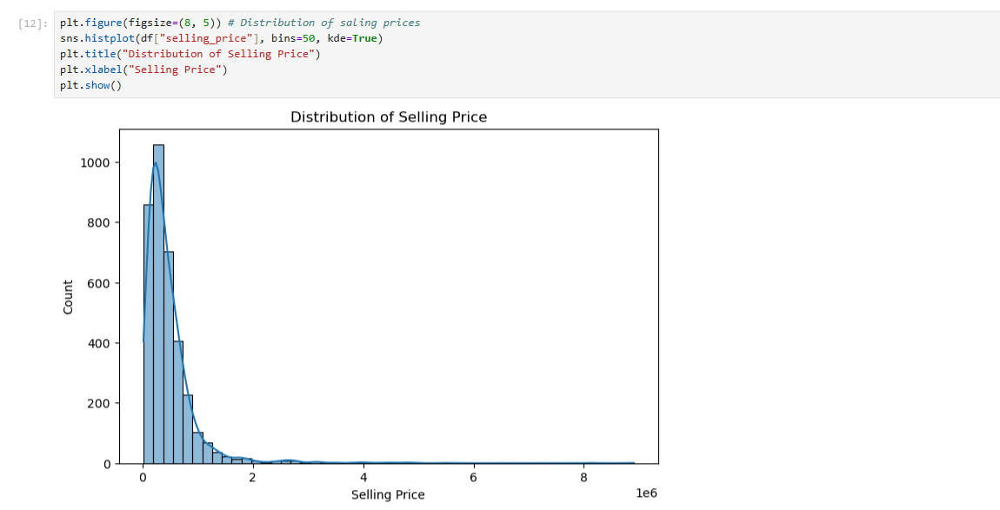
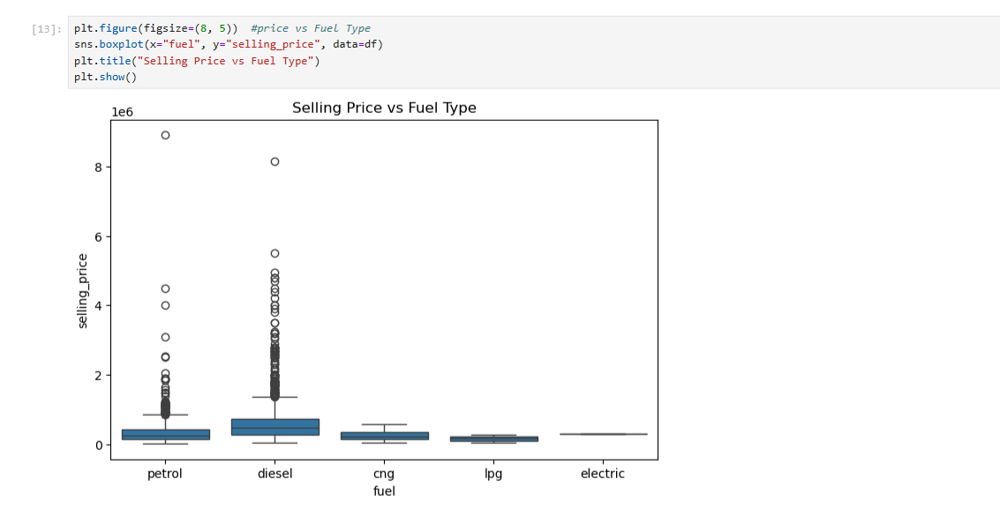
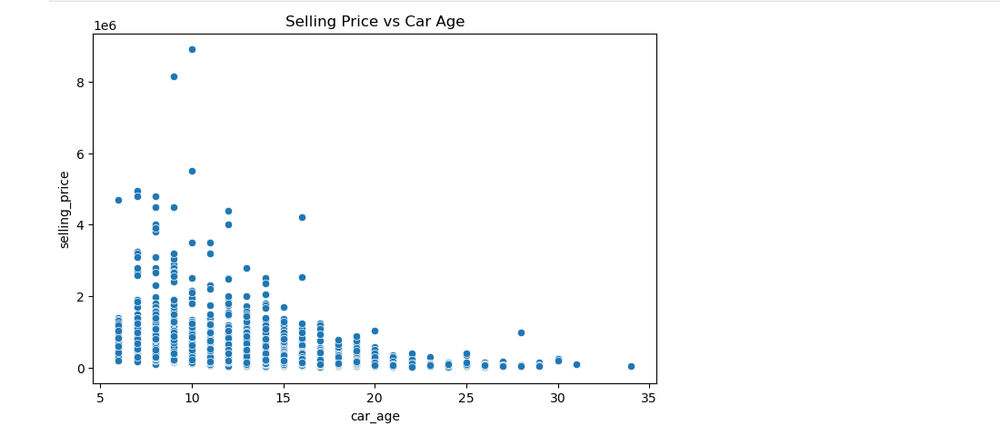
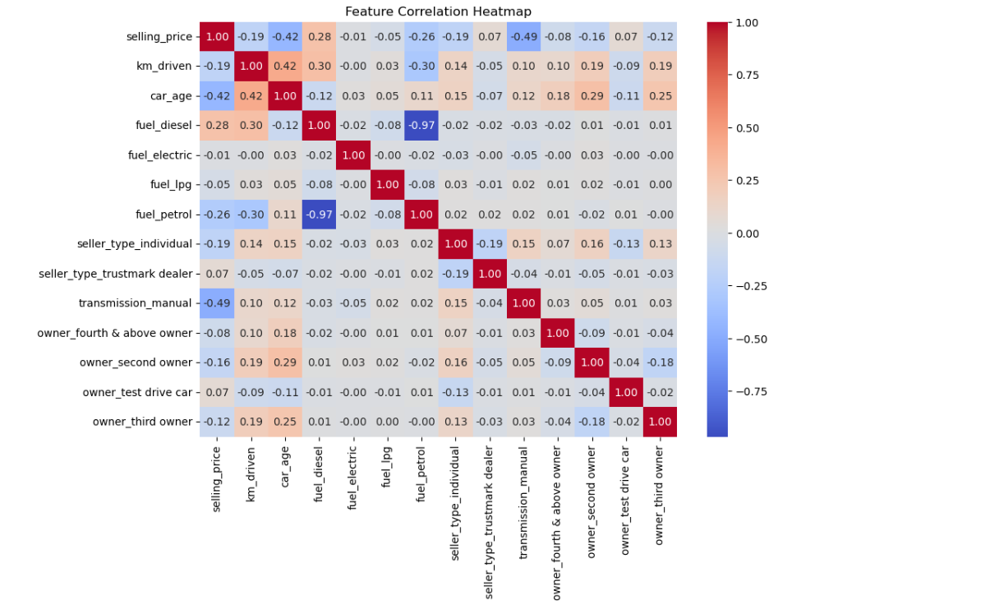
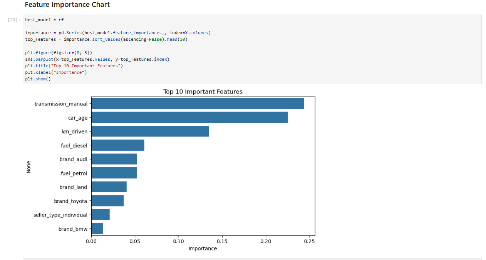

# 🚗 Used Car Price Prediction

A machine learning project that predicts the **selling price of a used car** using features like brand, age, kilometers driven, fuel type and transmission.

---

## 📌 Problem Statement

Given details of a used car, predict its selling price (in Indian Rupees).
Since price is a number, this is a **regression** problem.

---

## 🛠️ Tools Used

- Python
- pandas, numpy (data handling)
- matplotlib, seaborn (graphs)
- scikit-learn (machine learning)
- Jupyter Notebook

---

## 📂 Dataset

- **Name:** Vehicle dataset from CarDekho (Kaggle)
- **File:** `CAR DETAILS FROM CAR DEKHO.csv`
- **Columns:** name, year, selling_price, km_driven, fuel, seller_type, transmission, owner

---

## 🔄 Steps Followed

1. **Data Cleaning**
   - Checked and handled null values
   - Removed duplicate rows
   - Fixed text issues (made all text lowercase, removed extra spaces)

2. **Feature Engineering**
   - Created `car_age` = current year - year
   - Created `brand` from the first word of the car name

3. **EDA (Exploratory Data Analysis)**
   - Price distribution, price vs fuel type, price vs car age

4. **Encoding**
   - Used One-Hot Encoding to convert text columns to numbers

5. **Correlation Heatmap**
   - Checked which features are related to price

6. **Train/Test Split**
   - 80% training, 20% testing

7. **Model Training**
   - Linear Regression
   - Random Forest Regressor
   - Gradient Boosting Regressor

8. **Evaluation**
   - MAE, RMSE and R² score

9. **Feature Importance**
   - Found which features affect price the most

---

## 📊 Graphs

### Distribution of Selling Price


### Selling Price vs Fuel Type


### Selling Price vs Car Age


### Correlation Heatmap


### Top 10 Important Features


---

## 📈 Model Results

| Model             | MAE | RMSE | R² Score |
|-------------------|-----|------|----------|
| Linear Regression | X   | X    | X        |
| Random Forest     | X   | X    | X        |
| Gradient Boosting | X   | X    | X        |

**Best Model:** Random Forest (change this if your result is different)

---

## 🔍 Observations

- Most cars are in the lower price range; a few expensive cars make the price graph right-skewed.
- Older cars have lower selling prices.
- Diesel cars generally sell for more than petrol cars.
- Cars with higher km driven sell for less.
- Random Forest / Gradient Boosting performed better than Linear Regression because the price pattern is not a straight line.
- The most important features were **car age**, **km driven** and **fuel type** (and a few premium brands).

---

## ✅ Conclusion

The model can predict used car prices fairly well using basic car details. Tree-based models gave the best accuracy.

**Future improvements:**
- Use log of price to reduce skewness
- Tune hyperparameters
- Add more features like engine, mileage and seats

---

## ▶️ How to Run

1. Clone this repository
```
   git clone https://github.com/your-username/your-repo-name.git
   cd your-repo-name
```

2. Install the required libraries
```
   pip install pandas numpy matplotlib seaborn scikit-learn jupyter
```

3. Make sure the dataset CSV is in the same folder as the notebook

4. Open the notebook
```
   jupyter notebook
```

5. Open `car_price_prediction.ipynb` and click **Run All**

---

## 📁 Project Structure

```
├── car_price_prediction.ipynb
├── CAR DETAILS FROM CAR DEKHO.csv
├── images/
│   ├── price_distribution.png
│   ├── price_vs_fuel.png
│   ├── price_vs_age.png
│   ├── heatmap.png
│   └── feature_importance.png
└── README.md
```

---

## 👤 Author

Your Name
[GitHub](https://github.com/your-username) | [LinkedIn](https://linkedin.com/in/your-profile)
