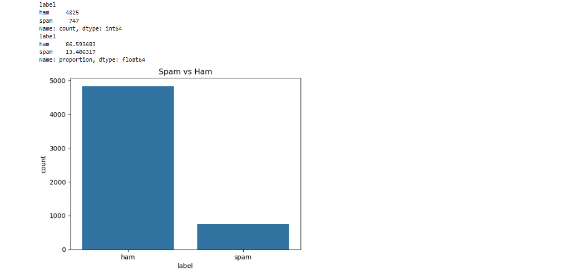
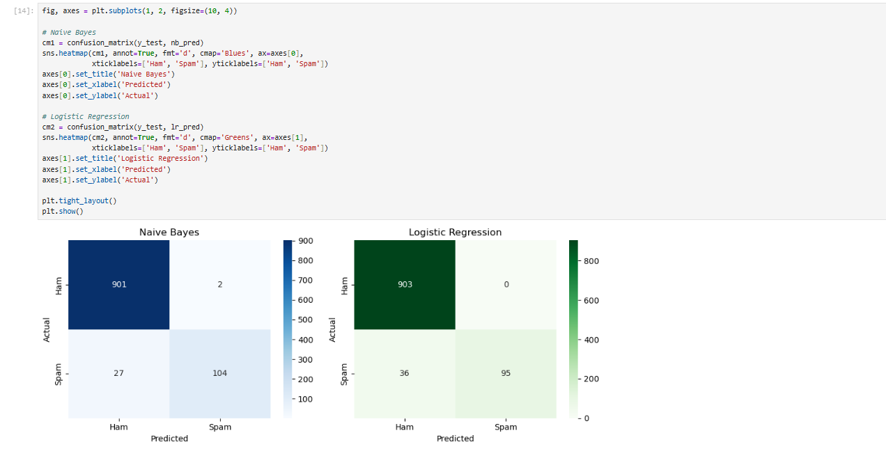
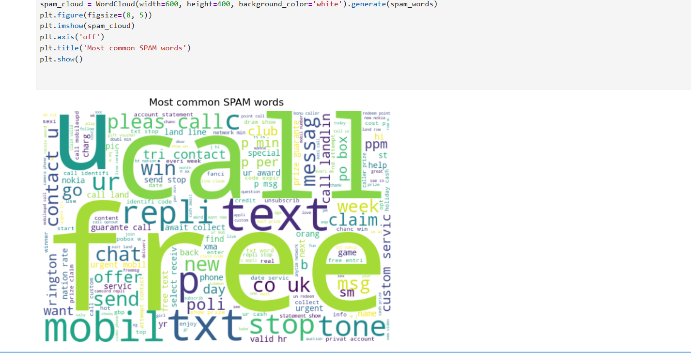
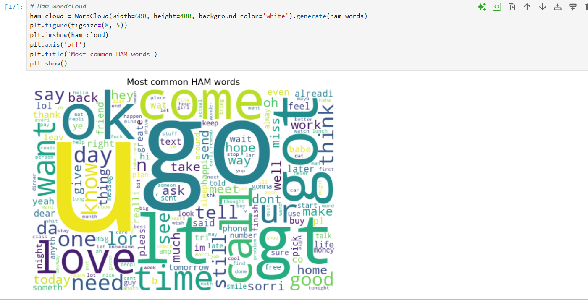

# 📩 Email/SMS Spam Detection using Machine Learning

A simple NLP project that classifies a message as **Spam** or **Ham** (not spam).

---

## 📌 Objective
Build a model that reads a text message and predicts whether it is spam or not.

---

## 🛠️ Tools Used
- Python
- pandas, numpy
- NLTK and re (text cleaning)
- scikit-learn (TF-IDF, Naive Bayes, Logistic Regression)
- matplotlib, seaborn (graphs)
- WordCloud (word visuals)
- Jupyter Notebook

---

## 📂 Dataset
- **SMS Spam Collection Dataset** (Kaggle / UCI)
- Total messages: **5572**
- Duplicates removed: **403**
- Messages used after cleaning: **5169**

---

## ⚙️ Steps Followed
1. Load the data and check class distribution
2. Remove duplicates and convert labels (ham = 0, spam = 1)
3. Clean the text:
   - Convert to lowercase
   - Remove punctuation and numbers
   - Remove stopwords (the, is, and...)
   - Apply stemming (winning → win)
4. Convert text to numbers using **TF-IDF**
5. Split data: 80% training, 20% testing
6. Train 2 models: **Multinomial Naive Bayes** and **Logistic Regression**
7. Evaluate using accuracy, precision, recall, F1-score and confusion matrix
8. Make WordClouds for spam and ham words

---

## 📖 What is TF-IDF?
TF-IDF gives a score to each word.
- **TF** = how many times a word appears in one message
- **IDF** = how rare that word is across all messages
- A word that is common in one message but rare overall gets a **high score**

---

## 📊 Class Distribution (after removing duplicates)

| Class | Count | Percentage |
|-------|-------|------------|
| Ham   | 4516  | 87.37%     |
| Spam  | 653   | 12.63%     |

The data is **imbalanced** (far more ham than spam).

---

## 🏆 Model Results

| Model                | Accuracy | Precision | Recall | F1-Score |
|----------------------|----------|-----------|--------|----------|
| Multinomial NB       | 97.20%   | 98.11%    | 79.39% | 87.76%   |
| Logistic Regression  | 96.62%   | 100%      | 73.28% | 84.58%   |

### Confusion Matrix (test set = 1034 messages)

| Model               | Ham correct | Ham wrong (FP) | Spam missed (FN) | Spam caught (TP) |
|---------------------|-------------|----------------|------------------|------------------|
| Multinomial NB      | 901         | 2              | 27               | 104              |
| Logistic Regression | 903         | 0              | 35               | 96               |

---

## 🔍 Observations
- Both models have high accuracy (above 96%).
- **Naive Bayes performed best** because it has higher recall (79%) and a better F1-score.
- Logistic Regression has **100% precision** (it never marked a good message as spam) but it missed more spam.
- Accuracy alone is misleading here, because a model that says "ham" for everything would still get about 87%.
- Spam messages often contain words like **free, call, txt, claim, prize, urgent, win**.
- Ham messages contain everyday words like **go, get, come, ok, love, know**.

---

## ❓ Why is Recall Important for Spam Detection?
Recall shows how much of the **real spam** the model catches. Low recall means spam
(scams, phishing links, fake prizes) reaches the inbox and can cause real harm.
Since spam is only about 13% of the data, accuracy can look high even when much spam
is missed, so recall is a better check. But recall should be balanced with precision
(using F1-score), or good messages may get blocked.

---

## 📈 Graphs Included
- Spam vs Ham count plot (class distribution)
 
- Confusion matrix heatmaps (Naive Bayes and Logistic Regression)

- WordCloud of spam words

- WordCloud of ham words


```

---

## ▶️ How to Run
1. Download `spam.csv` from Kaggle ("SMS Spam Collection Dataset") and keep it in the same folder as the notebook.
2. Install the libraries:
```
   pip install pandas numpy scikit-learn nltk matplotlib seaborn wordcloud
```
3. Open the notebook:
```
   jupyter notebook
```
4. Run all cells from top to bottom.

---

## 🧪 Test Your Own Message
```python
predict_message("Congratulations! You won a free iPhone. Click now to claim")  # SPAM
predict_message("Hey, are we meeting for lunch tomorrow?")                     # HAM
```

---

## ✅ Conclusion
Multinomial Naive Bayes gave the best balance of precision and recall for spam
detection. Future improvements: try SVM, use word pairs (`ngram_range=(1,2)`),
and handle the class imbalance to improve recall.

## 👤 Author

  SHUBHAM TIWARI

