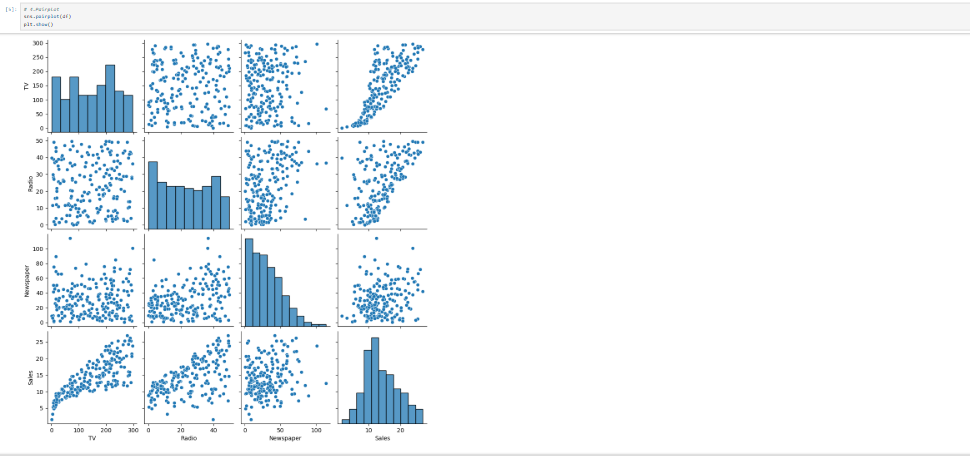
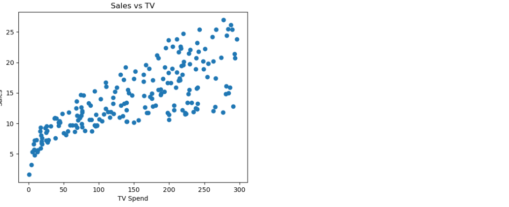
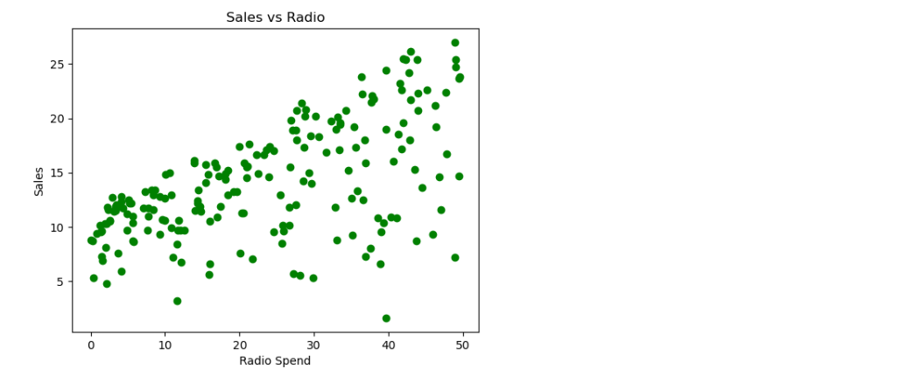
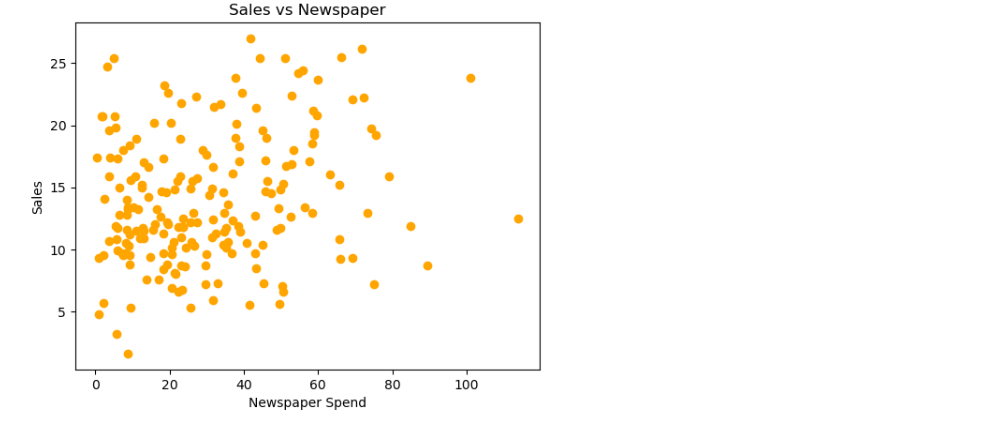
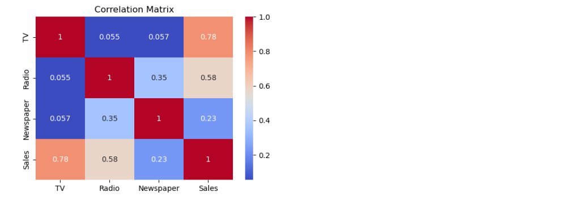
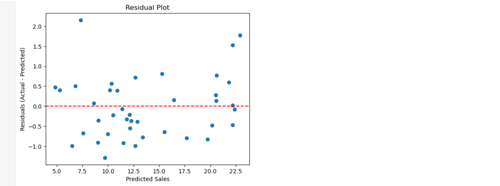
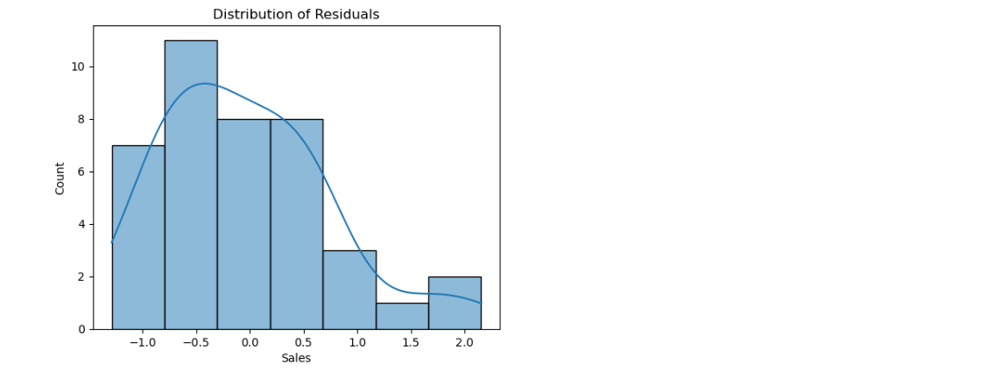

# 📈 Sales Prediction Using Python

A machine learning project that predicts product **sales** from advertising spend on **TV, Radio and Newspaper**.

---

## 🎯 Objective

Build a regression model that learns how advertising money affects sales, and find out which channel has the biggest impact.

---

## 🛠️ Tools Used

- Python
- pandas, numpy
- matplotlib, seaborn
- scikit-learn
- Jupyter Notebook

---

## 📂 Project Files

```
├── Sales_Prediction.ipynb              # main notebook
├── advertising budget and sales.csv    # dataset
├── images/                             # graphs used in this README
└── README.md
```

---

## 📊 Dataset

- 200 rows, 4 columns
- **TV, Radio, Newspaper** = advertising spend (input)
- **Sales** = product sales (output)
- No missing values found

| Column    | Mean   | Min  | Max    |
|-----------|--------|------|--------|
| TV        | 147.04 | 0.70 | 296.40 |
| Radio     | 23.26  | 0.00 | 49.60  |
| Newspaper | 30.55  | 0.30 | 114.00 |
| Sales     | 14.02  | 1.60 | 27.00  |

---

## 🔍 Steps Followed

1. Loaded the data and checked nulls and basic statistics
2. Made a pairplot, scatter plots and a correlation heatmap
3. Split the data into 80% train and 20% test
4. Trained **Linear Regression** (baseline model)
5. Trained **Random Forest Regressor** (second model)
6. Compared both models using MAE, RMSE and R²
7. Made a residual plot for the best model
8. Found the most important channel using coefficients and feature importance

---

## 🖼️ Graphs and Observations

### Pairplot


TV and Sales show a clear straight-line pattern.

### Sales vs TV


Strong upward trend. More TV spend means more sales.

### Sales vs Radio


Upward trend, but the points are more spread out.

### Sales vs Newspaper


Points are scattered everywhere. Very weak relationship.

### Correlation Heatmap


| Channel   | Correlation with Sales |
|-----------|------------------------|
| TV        | 0.78 (strong)          |
| Radio     | 0.58 (medium)          |
| Newspaper | 0.23 (weak)            |

Radio and Newspaper have a small link with each other (0.35). TV is almost independent of both.

---

## 🤖 Model Results

| Model             | MAE   | RMSE  | R² Score |
|-------------------|-------|-------|----------|
| Linear Regression | 1.461 | 1.782 | 0.899    |
| Random Forest     | 0.620 | 0.769 | 0.981    |

**Best model:** Random Forest (lowest errors and highest R²)

**Metrics in simple words:**
- **MAE** = average mistake size (lower is better)
- **RMSE** = like MAE but punishes big mistakes more (lower is better)
- **R²** = how much of the sales change the model explains (closer to 1 is better)

Random Forest explains about 98% of the change in sales. Its average error is less than half of Linear Regression's.

---

## 📉 Residual Plot



Residual = Actual sales − Predicted sales.



**Observation:** The points are randomly spread around the zero line with no curve or funnel shape. The average error is close to 0 (-0.03). So the errors are random, not systematic, and the model is reliable.

---

## 💡 Which Channel Matters Most?


**Random Forest feature importance:**

| Channel   | Importance |
|-----------|------------|
| TV        | 0.625      |
| Radio     | 0.362      |
| Newspaper | 0.013      |

**Linear Regression coefficients:**

| Channel   | Coefficient | Meaning                                  |
|-----------|-------------|------------------------------------------|
| TV        | 0.0447      | +1 unit spend gives about +0.045 sales   |
| Radio     | 0.1892      | +1 unit spend gives about +0.189 sales   |
| Newspaper | 0.0028      | almost zero effect                       |

---

## ✅ Conclusion

- **TV** has the biggest overall impact on sales (strongest correlation and highest importance).
- **Radio** gives the most extra sales per unit of money spent.
- **Newspaper** has almost no effect, so spending there is not worth it.
- **Random Forest** gave the best predictions (R² = 0.981).

---

## ▶️ How to Run

1. Download or clone this project
2. Install the libraries:
```
   pip install pandas numpy matplotlib seaborn scikit-learn jupyter
```
3. Keep the CSV file in the same folder as the notebook
4. Open Jupyter Notebook:
```
   jupyter notebook
```
5. Open `Sales_Prediction.ipynb`
6. Click **Kernel → Restart & Run All**

---

## 👤 Author

  SHUBHAM TIWARI
